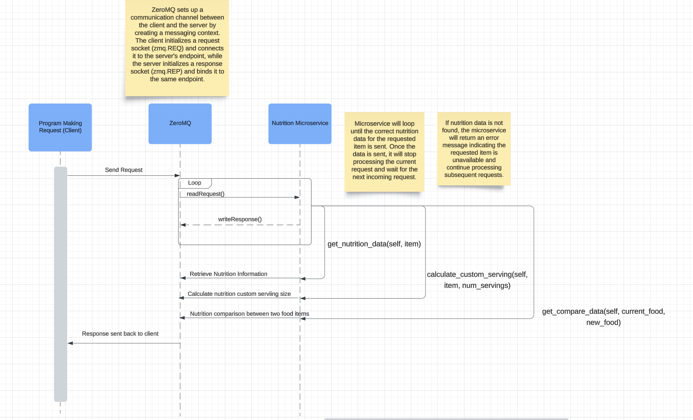

# Nutrition Service Microservice

A lightweight ZeroMQ-based microservice that provides nutritional information for food items. This service supports retrieving nutrition data, calculating custom serving sizes, and comparing nutritional values between two food items.

## Features

- **Retrieve Nutrition Data**: Get basic nutritional information (calories, protein, fat, etc.) for a food item.
- **Calculate Custom Serving Sizes**: Compute nutritional information based on the desired number of servings.
- **Compare Food Items**: Compare the nutritional values of two different food items.

## Installation

To set up the microservice, follow these steps:

1. Clone the repository:

   ```bash
   git clone https://github.com/paul-nguyen-1/Microservice-A-Nutrition.git
   cd path/Microservice-A-Nutrition.git
   ```
2. Installation
-  pip install pyzmq
-  python3 zeromq_server.py

## Instructions for Programmatically Requesting Data from the Microservice

1. **Set up the ZMQ Context and Socket**:

   - Use `zmq.Context()` to create a ZeroMQ context.
   - Use `context.socket(zmq.REQ)` to create a request socket.

2. **Connect to the Service**:

   - Use the `socket.connect("tcp://localhost:5555")` method to connect to the running microservice on port 5555.

3. **Send JSON Data**:

   - Use the `send_json()` method to send a JSON object containing the action and relevant parameters.

4. **Receive JSON Response**:
   - Use the `recv_json()` method to wait for and receive a JSON response.

Example Code for Requesting Nutrition Data

```
import zmq

# Create a ZeroMQ context and socket
context = zmq.Context()
socket = context.socket(zmq.REQ)
socket.connect("tcp://localhost:5555")  # Connect to the microservice

# Request nutrition data for an item
item = "Veggie Lasagna"
request = {"action": "retrieve_nutrition", "item": item}
socket.send_json(request)  # Send the request

# Receive the response
response = socket.recv_json()
print(f"Nutrition data for {item}: {response}")

```

---

## Instructions for Programmatically Receiving Data from the Microservice

1. **Set up the ZMQ Context and Socket**:

   - Use `zmq.Context()` to create a ZeroMQ context.
   - Use `context.socket(zmq.REP)` to create a reply socket.

2. **Bind the Socket to a Port**:

   - Use `socket.bind("tcp://*:5555")` to bind the server to port 5555.

3. **Handle Requests**:

   - Use the `recv_json()` method to receive a JSON request from the client.
   - Process the request and create an appropriate response.

4. **Send the Response**:
   - Use the `send_json()` method to send a JSON response back to the client.

Example Code for Receiving Data (Server Implementation):

```
import zmq

# Create a ZeroMQ context and socket
context = zmq.Context()
socket = context.socket(zmq.REP)
socket.bind("tcp://*:5555")  # Bind the service to port 5555

print("Nutrition Service is running...")

# Process incoming requests
while True:
    request = socket.recv_json()  # Receive the request
    action = request.get("action")
    item = request.get("item")

    # Generate a response based on the action
    if action == "retrieve_nutrition" and item:
        response = {
            "item": item,
            "nutrition_data": {"calories": 150, "protein": 7, "fat": 5}  # Mock data
        }
    else:
        response = {"error": "Invalid request"}

    socket.send_json(response)  # Send the response
```

Example Call Interaction
Client Request:

```
{
    "action": "retrieve_nutrition",
    "item": "Veggie Lasagna"
}
```

Server Response:

```
{
    "item": "Veggie Lasagna",
    "nutrition_data": {
        "calories": 150,
        "protein": 7,
        "fat": 5
    }
}
```


# UML Diagram


